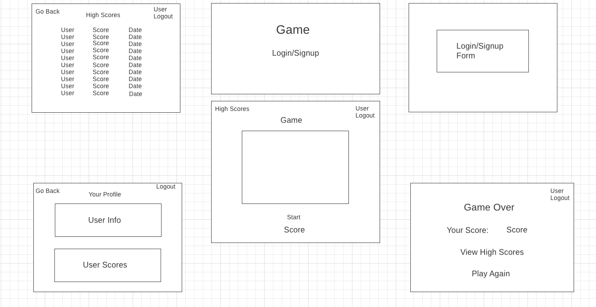
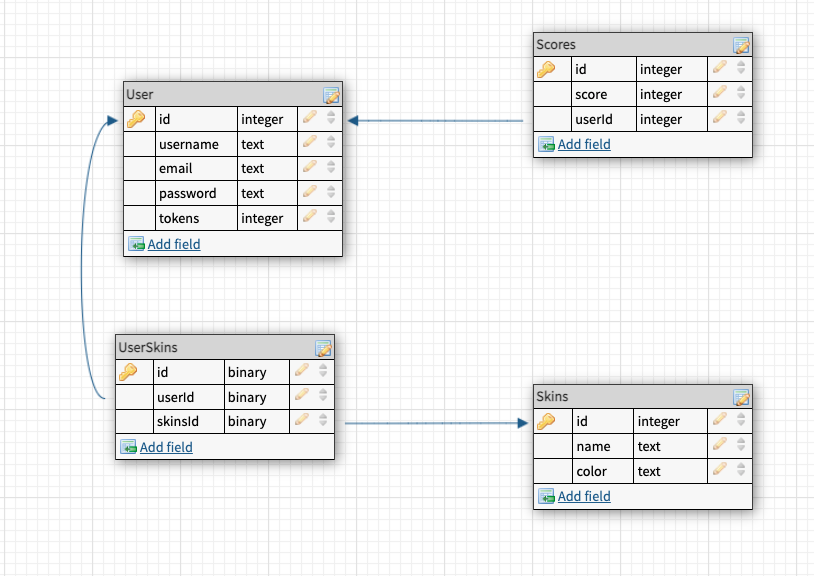
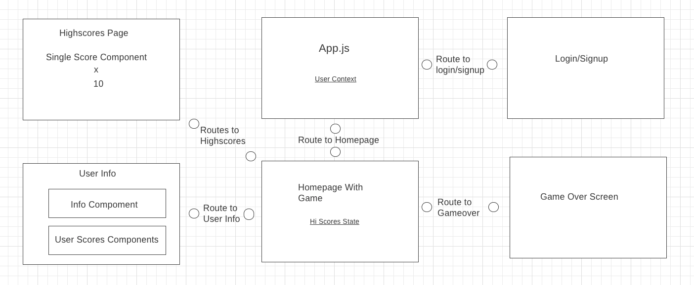

# Complete_Game_Frontend

### Overview

Takes the video game Lizard project from unit 1 and vamps it up with additional features such as User Auth weith CRUD operations, score keeping, highest scores display, and a simplified gacha system where one can change the skin of the lizard with whatever skins they have rolled.  

### Wireframe

## User Stories 
-When I go to the site, I am sent to the homepage which just contains the Logo and the link to the login/signup. 

-I am able to successfully login

-When logged in, the homepage contains the game 

-Pressing the start button initiates the game 

-When the game is over, I am redirected to the game over screen 

-From the game over screen, I can view my score as well as the links to the highscores and play-again option are present 

-From the homepage with the game, I can select to view the top 10 high scores, redirecting to a different page

-From the homepage with the game, I can select to view my profile, from where I can view my user Info 

-The user info contains my username(editable), email, password, token count, and all of the user's scores from their runs 

-I am able to logout successfully by clicking the logout button from almost all the pages (except for the login and sign up forms)

### Routes 

|Routes                     | HTTP Verb                       | URL                            |
| :----------------------: | ------------------------------- | ------------------------------- |
| userRoute     | .post    | '/signup'                            |
| userRoute     | .post    | '/login'                             |
| userRoute     | .get     | '/verify'                            |
| userRoute     | .get     | '/:userId/info'                      |
| userRoute     | .get     | '/userId/scores/'                    |
| userRoute     | .post    | '/:userId/score'                     |
| skinsRoute    | .post    | '/skins/:skinId/user/:userId'        |
| scoreRoute    | .get     | '/scores'                             |

### MVP

-Functional Game

-User Auth

-Viewable high scores

-Viewable user info 

-Successful gacha implementation

## Stretch Goals

-password hashing 

-sound effect during point aquisition
